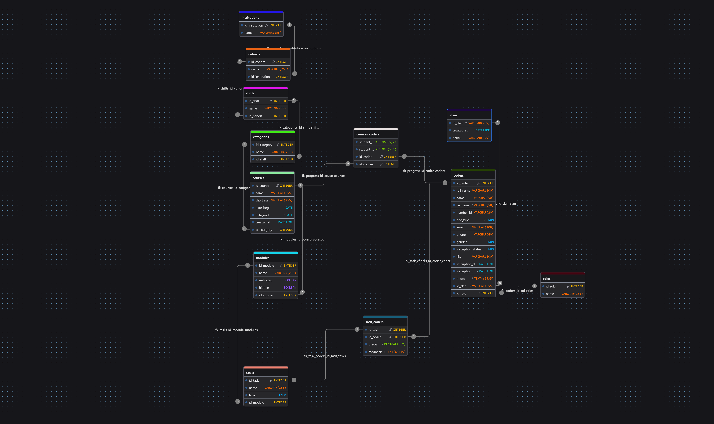

# 📚 Database Documentation `riwi_harvest_db`

## 1. General Description

The `riwi_harvest_db` database is designed to manage academic and institutional information with a clear hierarchy of entities. It covers:

- Institutions, cohorts, shifts, and categories as the **organizational hierarchy**.
- Courses and modules as the **academic structure**.
- Coders, clans, and roles as the **student and user management system**.
- Tasks, task_coders, and course enrollment (courses_coders) as the **academic performance tracking**.

The main goal is to centralize and structure academic data, ensuring **referential integrity, scalability, and consistency**, while enabling efficient decision-making.

---

## 2. Entity-Relationship Model

## 3. Table Relationships (Summary)

- **institutions** 1 ────< **cohorts** (An institution hosts several cohorts).
- **cohorts** 1 ────< **shifts** (Each cohort has multiple shifts).
- **shifts** 1 ────< **categories** (Each shift can have different categories).
- **categories** 1 ────< **courses** (A category contains multiple courses).
- **courses** 1 ────< **modules** (A course consists of several modules).
- **modules** 1 ────< **tasks** (Each module defines several tasks).
- **tasks** M ────< **task_coders** >──── M **coders** (Coders receive grades and feedback for each task).
- **coders** M ────< **courses_coders** >──── M **courses** (Coders are enrolled in multiple courses, with progress and grades tracked).
- **clans** 1 ────< **coders** (Coders belong to a clan).
- **roles** 1 ────< **coders** (Each coder has a role).

---

## 4. Main Tables Overview

### 🏛️ Institutions

Stores the academic institutions that serve as the top-level entity.

### 🎓 Cohorts

Represents student generations, linked to an institution.

### ⏰ Shifts

Defines study shifts (e.g., morning, afternoon), linked to cohorts.

### 🗂️ Categories

Classifies courses within a shift.

### 📚 Courses

Stores academic courses, linked to categories. Each course has a start/end date and creation timestamp.

### 📘 Modules

Subdivisions of courses, which may be restricted or hidden.

### 📑 Tasks

Assignments or activities within a module.

### 👤 Coders

Stores student data (personal, academic, and contact information), linked to clans and roles.

### 🏹 Clans

Organizational grouping of coders.

### 🛡️ Roles

Defines user roles (e.g., student, mentor).

### 🔗 Courses_Coders

Junction table (many-to-many) to track coders’ enrollment, progress, and grades in courses.

### 📝 Task_Coders

Junction table (many-to-many) to track coders’ performance on tasks, including grade, feedback, type, and graded timestamp.

---

## 5. Technical Notes

- **ENUM types** are used to enforce categorical values (e.g., gender, doc type, inscription status, grade type).
- **FOREIGN KEYS** maintain referential integrity with `CASCADE`, `RESTRICT`, `SET NULL`, and `NO ACTION` rules to control propagation.
- **UNIQUE constraints** are applied on critical fields (e.g., email, number_id, clan id).
- **BOOLEAN flags** (`restricted`, `hidden`) manage content visibility in modules.
- **Scalability**: The structure allows adding institutions, cohorts, shifts, categories, courses, and modules without breaking consistency.
- **Logical separation**: Strong hierarchy tables (institutions, cohorts, shifts, categories, courses, modules) provide the structure, while weak hierarchy tables (coders, tasks, task_coders, roles, clans) provide flexibility.
